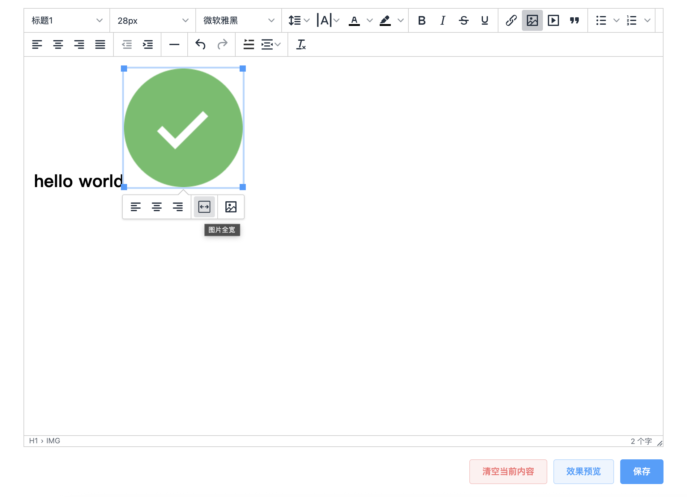

# tinymce-editor

## Preview


在 tinymce 的基础上，自定义了以下几个插件功能

- 首行缩进
- 两端缩进
- 字间距 letterspacing
- 图片自适应宽度

## Project setup
```
yarn install
```

### Compiles and hot-reloads for development
```
yarn serve
```

### Compiles and minifies for production
```
yarn build
```

### Lints and fixes files
```
yarn lint
```

### Customize configuration
See [Configuration Reference](https://cli.vuejs.org/config/).
